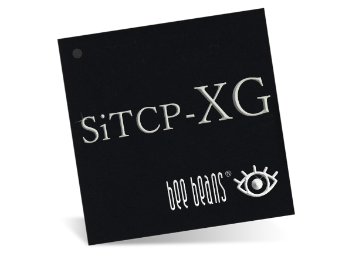

Read this in other languages: [English](README.md), [日本語](README.ja.md)

# SiTCPXG Netlist for Kintex UltraScale

SiTCPXG Library (edif file) for AMD Kintex UltraScale.


## What is SiTCPXG

Simple TCP/IP implemented with support only for 10GbE on an FPGA (Field Programmable Gate Array) for the purpose of transferring large amounts of data in physics experiments.

* For details, please refer to [SiTCP Library page](https://www.bbtech.co.jp/en/products/sitcp-xg-license/).
* For other related projects, please refer to [here](https://github.com/BeeBeansTechnologies).




## History

#### 2024-12-26 Ver.1.0

* First release.

